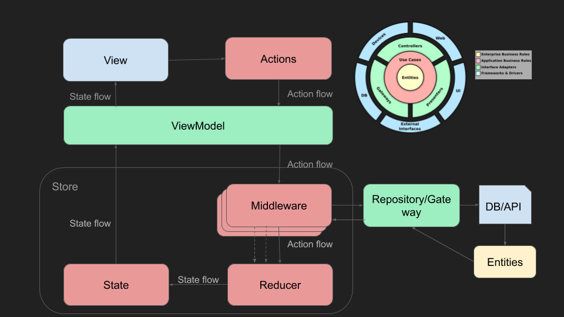

# Пример использования Kotlin multiplatform для TODO приложения
---

Презентация: [Kotlin multiplatform: Android + iOS + Backend в одном моно-репозитории
](https://docs.google.com/presentation/d/1h7Yf_tDJLnHDxxzjIiPLja7fI4E5Rz94ltLmwwoKkJ8/edit?usp=sharing)

## Архитектура приложения
Приложение использует подход Clean Architecture или "слоистой" архитектуры


#### Entities
Все части приложения(Android, iOS, Backend) зависят от слоя Entities(Domain) модуль `domain`. 

В этом кросплатформенном модуле собраны бизнес-сущности приложения
```kotlin
/**
 * Структура данных задачи
 *
 * @property id - уникальный идентификатор задачи
 * @property title - заголовок задачи
 * @property description - подробное описание задачи
 * @property status - текущее состояние задачи [TaskStatus]
 */
data class Task(
    val id: String,
    val title: String,
    val description: String,
    val status: TaskStatus
)
```

#### UseCase(Interactors)
Для Android и iOS общий модуль `interaction`. Backend представлен в виде единого монолитного модуля `todo` в котором есть свой слой UseCase

В модуле `interaction` используется паттерн проектирования MVI

Пример редуктора состояний:
```kotlin
class TodoReducer : Reducer<TodoState, TodoAction> {

    override fun reduce(state: TodoState, action: TodoAction): TodoState = when (action) {
        TodoAction.Idle,
        TodoAction.CreateTask -> state
        is TodoAction.Switch,
        TodoAction.Archive,
        is TodoAction.Unarchive,
        TodoAction.Load -> state.copy(isLoading = true)
        is TodoAction.Loaded -> state.copy(
            isLoading = false,
            todoList = action.tasks,
            showArchive = action.tasks.fold(false) { result, task ->
                result || task.status == TaskStatus.DONE
            },
            error = ""
        )
        is TodoAction.Error -> state.copy(
            isLoading = false,
            error = action.message
        )
    }.freeze()
}
```
Пример бизнес-логики в Middleware:
```kotlin
class TaskLoadMiddleware(
    private val taskRepository: TaskRepository,
    private val schedulers: Schedulers
) : Middleware<TodoAction, TodoState> {

    override fun bind(
        actions: Observable<TodoAction>,
        state: Observable<TodoState>
    ): Observable<TodoAction> = actions.ofType<TodoAction.Load>()
        .flatMapSingle {
            taskRepository.allTasks()
                .subscribeOn(schedulers.io)
                .map { TodoAction.Loaded(it) }
                .onErrorReturn { TodoAction.Error(it.message ?: "") }
        }
}
```
#### Platform adapters
Слой адаптеров платформенных компонентов, для каждой платформы свой:

Пример ViewModel для Android:
```kotlin
open class BaseViewModel<S : State, A : Action>(
    private val store: Store<S, A>,
    private val factory: Map<Class<*>, @JvmSuppressWildcards ComponentBuilder>
) : ViewModel(), ComponentFactoryHolder {

    val state = store.states()

    override fun onCleared() {
        store.dispose()
        super.onCleared()
    }

    fun acceptAction(action: A) {
        store.acceptAction(action)
    }

    override fun factory(): Map<Class<*>, ComponentBuilder> = factory
}

class TodoListViewModel @Inject constructor(
    store: Store<TodoState, TodoAction>,
    factory: Map<Class<*>, @JvmSuppressWildcards ComponentBuilder>
) : BaseViewModel<TodoState, TodoAction>(store, factory)
```
Пример ViewModel для iOS:
```swift
class Container<S: State, A: Action> {
    
    private let schedulers: Schedulers
    private let closure: (S) -> Void
    
    private var disposable: Disposable? = nil
    private var store: Store<S, A>? = nil
    
    init(_ schedulers: Schedulers, closure: @escaping (S) -> Void) {
        self.schedulers = schedulers
        self.closure = closure
    }
    
    func onAppear(store: Store<S, A>) {
        dispose()
        self.store = store
        let states = IosObserwableWrapper<S>(inner: store.states())
        disposable = states
            .observeOn(scheduler: schedulers.main)
            .subscribe(isThreadLocal: true, onSubscribe: nil, onError: nil, onComplete: nil) { state in
            self.closure(state!)
        }
    }
    
    func onDisappear() {
        dispose()
        self.store = nil
    }
    
    func acceptAction(action: A) {
        store?.acceptAction(action: action)
    }
    
    private func dispose() {
        if disposable != nil && disposable?.isDisposed == false {
            disposable?.dispose()
        }
    }
}

final class TodoListViewModel : ObservableObject {
    
    var container: Container<TodoState, TodoAction>?
    
    var isLoading = false
    var error = ""
    var tasks: Array<TaskPresentable> = []
    var showArchive = false
    
    func acceptAction(action: TodoAction) {
        container?.acceptAction(action: action)
    }
    
    func onAppear(store: Store<TodoState, TodoAction>) {
        container?.onAppear(store: store)
    }

    func onDisappear() {
        container?.onDisappear()
    }
}

final class TodoListFactory {
    
    static func create(schedulers: Schedulers, model: TodoListViewModel) -> Container<TodoState, TodoAction> {
        return Container<TodoState, TodoAction>(schedulers) { state in
            print(state)
            model.isLoading = state.isLoading
            model.error = state.error
            model.tasks = state.todoList.map {
                TaskPresentable(
                    id: $0.id,
                    title: $0.title,
                    description: $0.component3(),
                    status: $0.status
                )
            }
            model.showArchive = state.showArchive
            model.objectWillChange.send()
        }
    }
}
```
Пример контроллера для Backend:
```kotlin
@RestController
class TaskController @Autowired constructor(
    private val interactor: TaskInteractor
) {

    @GetMapping("/tasks")
    fun tasks() = interactor.tasks()

    @PostMapping("/tasks")
    fun createTask(@RequestBody task: TaskPost) = interactor.createTask(task)

    @PatchMapping("/tasks/{id}")
    fun switchTask(@PathVariable id: String) = interactor.switchTask(id)

    @PostMapping("/tasks/archive")
    fun archiveTasks() = interactor.archiveTasks()
}
```
#### Platform

Пример View в Android:
```kotlin
 abstract class BaseFragment<S : State, A : Action, P : Parcelable, VM : BaseViewModel<S, A>> :
    DaggerFragment() {

    @Inject
    lateinit var componentFactoryHolder: ComponentFactoryHolder
    protected lateinit var viewModel: VM
    
    /*CODE*/

    protected abstract val viewModelClass: Class<VM>

    @CallSuper
    override fun onCreate(savedInstanceState: Bundle?) {
        super.onCreate(savedInstanceState)

        savedState = savedInstanceState?.let {
            it.getParcelable<P>(SAVED_STATE)?.toDomain()
        }
        viewModel = ViewModelProviders.of(
            this,
            ViewModelFactory<S, VM>(savedState,
                componentFactoryHolder.factory())
        ).get(viewModelClass)
    }

    @CallSuper
    override fun onViewCreated(view: View, savedInstanceState: Bundle?) {
        renderingDisposable = viewModel.state
            .observeOn(schedulers.main)
            .subscribe(isThreadLocal = true) {
                render(it)
            }
    }

    @CallSuper
    override fun onSaveInstanceState(outState: Bundle) {
        super.onSaveInstanceState(outState)

        savedState?.apply {
            outState.putParcelable(SAVED_STATE, toParcelable())
        }
    }

    @CallSuper
    override fun onDestroyView() {
        renderingDisposable.dispose()
        super.onDestroyView()
    }

    protected abstract fun render(state: S)

    protected abstract fun P.toDomain(): S

    protected abstract fun S.toParcelable(): P
}

class TodoListFragment : BaseFragment<TodoState, TodoAction, TodoParcelable, TodoListViewModel>() {

    override val viewModelClass: Class<TodoListViewModel>
        get() = TodoListViewModel::class.java

    private var todoAdapter: TodoListAdapter? = null

    /*CODE*/

    override fun onViewCreated(view: View, savedInstanceState: Bundle?) {
        super.onViewCreated(view, savedInstanceState)

        todoAdapter = TodoListAdapter {
            viewModel.acceptAction(TodoAction.Switch(it))
        }

        with(todoListRv) {
            layoutManager = LinearLayoutManager(requireContext())
            addItemDecoration(DividerItemDecoration(requireContext(), LinearLayoutManager.VERTICAL))
            adapter = todoAdapter
        }

        updateStr.setOnRefreshListener {
            viewModel.acceptAction(TodoAction.Load)
        }

        createBtn.setOnClickListener {
            viewModel.acceptAction(TodoAction.CreateTask)
        }
        archiveBtn.setOnClickListener {
            viewModel.acceptAction(TodoAction.Archive)
        }
    }

    override fun onDestroyView() {
        todoAdapter = null
        super.onDestroyView()
    }

    override fun render(state: TodoState) {
        todoAdapter?.submitList(state.todoList)

        val transition = AutoTransition()
        transition.excludeChildren(R.id.updateStr, true)
        transition.excludeTarget(R.id.updateStr, true)
        TransitionManager.beginDelayedTransition(root, transition)
        updateStr.isRefreshing = state.isLoading
        val hasError = state.error.isNotEmpty()
        errorTxt.isVisible = hasError
        createBtn.isVisible = !hasError
        todoListRv.isVisible = !hasError
        errorTxt.text = state.error
        archiveBtn.isVisible = state.showArchive
    }

    override fun TodoParcelable.toDomain(): TodoState =
        TodoState(
            isLoading = isLoading,
            error = error,
            showArchive = showArchive
        )

    override fun TodoState.toParcelable(): TodoParcelable =
        TodoParcelable(
            isLoading = isLoading,
            error = error,
            showArchive = showArchive
        )
}
```
Пример View для iOS:
```swift
struct TodoListView: View {
    
    @ObservedObject var model: TodoListViewModel
    var context: DIContext
    var inputData: Any?
    
    var body: some View {
        ZStack {
            List(model.tasks) { task in
                TaskView(task: task).onTapGesture {
                    self.model.acceptAction(
                        action: TodoAction.Switch(
                            id: task.id
                        )
                    )
                }
            }
            
            if !model.error.isEmpty {
                Text(model.error)
            }
            
            if model.isLoading {
                ProgressBar()
            }
        }.navigationBarTitle(Screen.todoList.description())
        .navigationBarItems(
            leading: EmptyView(),
            trailing: HStack {
                Button(
                    action: { self.model.acceptAction(action: TodoAction.CreateTask()) },
                    label: { Text("Create") }
                )
                if model.showArchive {
                    Button(
                        action: { self.model.acceptAction(action: TodoAction.Archive()) },
                        label: { Text("Archive") }
                    )
                }
                Button(
                    action: { self.model.acceptAction(action: TodoAction.Load()) },
                    label: { Text("Refresh") }
                )
            }
        ).onAppear() {
            self.model.onAppear(store: TodoListAssembly.instance(from: self.context).todoListStore)
        }.onDisappear() {
            self.model.onDisappear()
        }
    }
}
```
